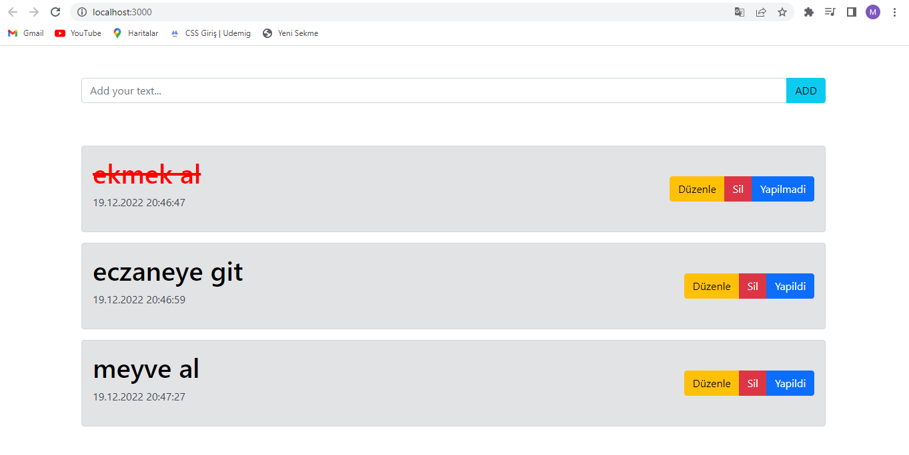
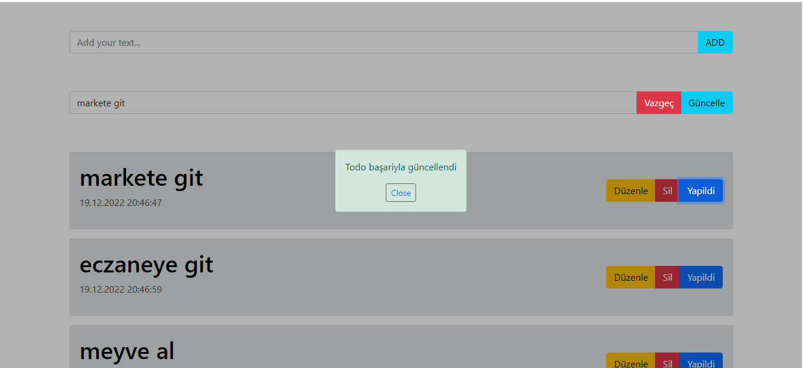
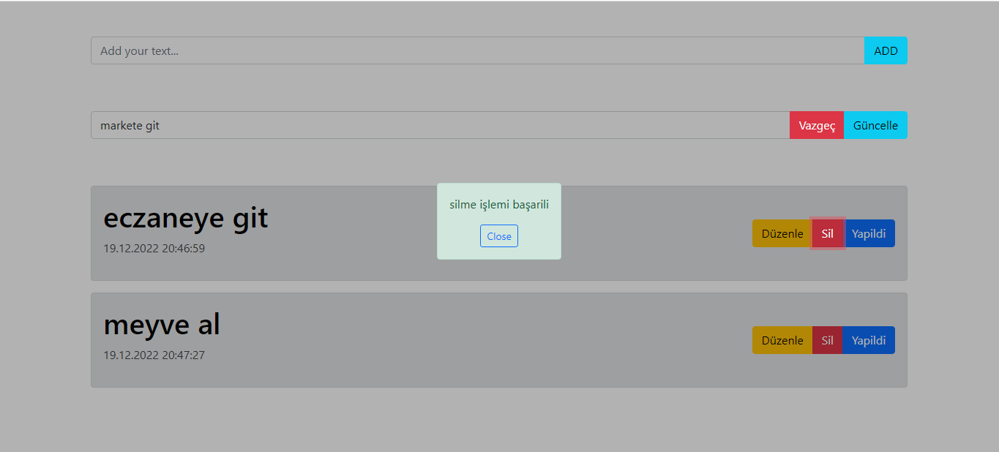

## TODOLIST PROJESİ

# Bu projede axios kullanılarak React ile TodoList yapılmıştır. db.jason dosyası açılarak sanal bir veritabanı oluşturulmuştur. Bu veritabanına axios kullanılarak TodoList'e eklediğimiz veriler aynı zamanda veritabanına da kaydedilmiştir.

# İlk resimde ekle butonuna tıkladığımızda verilerimiz aşağıda listelenmektedir ve düzenle butonuna tıkladığımızda ise hem üzeri çizilmekte hem de kırmızı bir renk almaktadır.

# İkinci resmimizde todolarımızdan hangisinde düzenle butonuna tıklarsak onu güncellemek üzere bir input daha açılır ve inputumuza veri girip güncelle butonuna tıklarsak todomuz güncellenecektir. Todo Başarı ile güncellendi diye bir alert oluşacaktır.

# Üçüncü resmimizde silme butonuna tıkladığımızda todomuz ekrendan silinip ekranda silme işlemi başarılı diye bir alert oluşacaktır. Alerti tıkladığımızda silinecektir.

